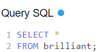

**TLDR**: Knowing SQL is a must for data professionals. No point learning advanced techniques without knowing how to extract data. No one is going to extract data for you (or, at least, it is rare to avoid bottlenecks). SQL is a great tool to learn how to *think* in terms of data structures. I personally love subqueries, the functions PARTITION BY, CASE and indexes. Order matters.

**SQL Motivation**

Ok, after flirting with the idea of deep diving into SQL, I've finally made the decision to get started with Danny MA's <a href="https://8weeksqlchallenge.com/">8  Weeks SQL Challenge</a>. The decision was easy (SQL is a key skill), the implementation a bit harder (I just had a 3-months old toddler). 

Committing to this challenge was my turning point. Working in small sprints made it happen.

I already know a bit about SQL as I use it professionally at work. So why starting this challenge? Why not jumping straight into deep learning? Two reasons: first, I wanted to move beyond the context-specific problems I'm already solving at work, second, I wanted to boost my confidence and finally state that I know advanced SQL (F-You Impostor Syndrome!).

So, here's how the first week went.

**Welcome to Dannys'**

Danny is a gourmant (he loves good food). In a few clicks one can enter and explore what his customers' order from the menu. Luckily Danny is also skilled in SQL, which means that information on such tastes is well organised and accessibles. In 7 words: one can learn SQL through real-life examples.

I love the realism of the exercises, good approximation of stakeholders' questions. Also, one can test-drive them in real time in a dedicated environment, which is helpful for effective learning (although <a href="https://dbeaver.io/">DBeaver</a> the error messages are bit clearer).

**Anatomy of a query**

I love thinking in SQL terms. The required mindset to use this language effectively is quite different from the data-analysis one. I am trained as an economist, hence when I think about data issues I have a regression-mindset: 

<ul>
  <li>What explains what?</li>
  <li>Where does partial correlation lies?</li>
  <li>How robust the identified partial-correlation is likely to be?</li>
</ul>

When it comes to SQL I find the approach to be rather different. When I SQL (is it a verb?) I think in terms of nested cubes, or matryoshka dolls. I see the problem at hand and I try to address it in consecutive steps: 

<ul>
  <li>What data structure would make the problem clearer?</li>
  <li>What features / calculated fields do I need to add to get my answer?</li>
  <li>Which aggregations are needed to summarize my answer effectively?</li>
</ul>

This mindset is great to really understand databases, a skill for life. On the plus side getting into this mindset greatly helps in communicating with my fellow data engineers, reducing the chances of getting lost in translation.

**Week 1: no jokes**

Here I share what I loved the most about the learning process and what I think might be helpful for future use. You can find my complete anwers <a href="https://github.com/nstamboglis/8WeekSQLChallenge/blob/main/DM8WSC_W1.sql">here</a> if you're curious (let me know if you find bugs and/or better ways of solving the use cases!). 

*Sub-queries:*

<code>This is a test</code>

*Partition by:*

*Case When:*

*Indexes:*

*Bonus point: style & order matter!*

**Next steps**

Completing the first week was a motivation booster for me. Now I plan to learn the resources and explore other peoples' solutions. I'd like to make sure I'm approaching the tasks correctly rather than progressing with faulty ways. Once the challenge will be completed I plan to purchase Dannys' solutions to make sure I got them right (price is reasonable).
